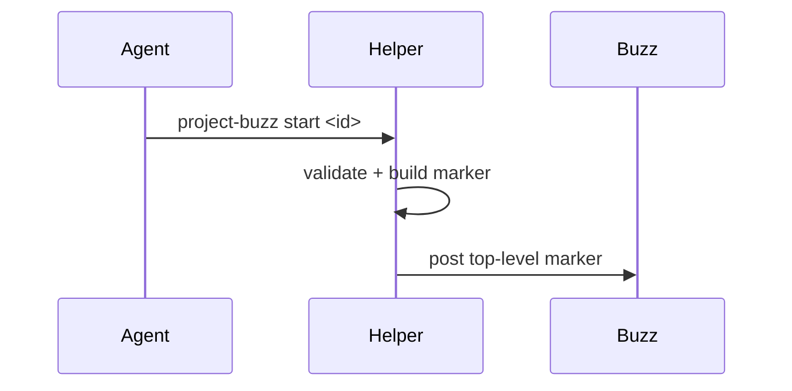

# Show Me

Skip the preamble and keep prose brief. Pick the smallest view that makes the
point clear, then place it next to the one or two sentences it supports.

Buzz renders fenced code blocks as plain text. Every visual must survive
without images, so prefer ASCII structures and Mermaid inside fenced blocks.
Use a focused HTML file only for a local preview you open yourself, or render
it and attach the result as a PNG. Never put a bare `file://` link in a Buzz
post.

## When to use it in the channel

- `start` or `progress`: the shape of the plan, the steps, the ownership.
- `result`: what changed, or the verified flow from request to evidence.
- `correct`: what the retracted claim said and what now holds instead.
- `open`: the open-thread shape instead of a scrolling list.

## Visuals that survive a text-only channel

Show logic or an algorithm as pseudocode:

```text
on(open)
  group messages by thread root
  if thread has any of result, blocked, correction
    close it
  else
    list it as open
```

Show control flow as a call tree, or a plan as numbered steps:

```text
publish an update
  validate content     (length, secrets, mentions, German)
  build marker         (phase, agent, update id)
  write lock guard
  post to the channel
  store dedup output
```

Show structure as a component or file tree:

```text
buzz-comms/
├── scripts/project-buzz      # deterministic helper
├── skills/buzz-team-communication/   # behavioural contract
└── skills/show-me/           # compact visuals for posts
```

Show a component or state change as a diff against the known shape:

```diff
- group updates by update id
+ group messages by thread root
```

Show interaction or data flow with Mermaid:



## Rules for the channel

- Keep diagrams narrow, under 80 columns, and self-explanatory. A reader must
  get the point without surrounding prose.
- One visual per message. Do not stack several diagrams in one update.
- Use real labels: the actual project, agent, and file names. No placeholder
  "XXX" or "TODO" in a published picture.
- Put ASCII block diagrams and Mermaid inside fenced code blocks only. A raw
  ASCII block without fences is unreadable in the Buzz timeline.
- HTML is a local preview or a PNG attachment, never a link inside a post.
- Edit the caption around the visual with the `no-ai-slop` skill like any other
  lifecycle text. The picture does not replace the prose; it sharpens it.
